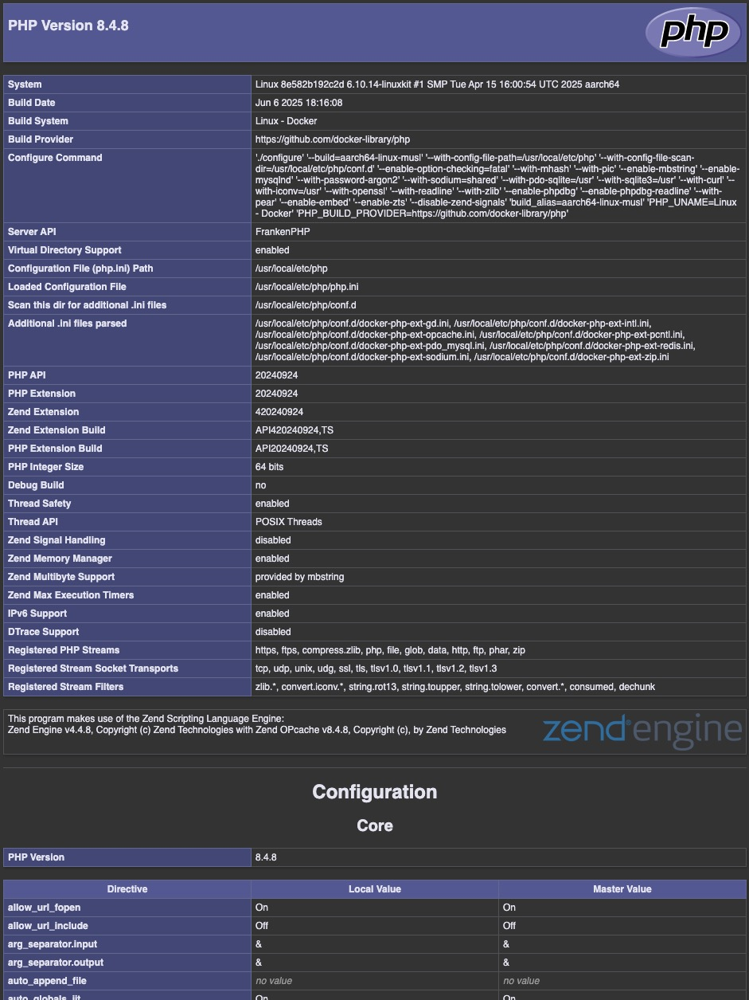

# Dockerized CodeIgniter 3 with FrankenPHP

A modern development and production-ready environment for CodeIgniter 3 applications, powered by FrankenPHP, MariaDB, and phpMyAdmin.

This project includes minimal patches to the CodeIgniter 3 core to ensure compatibility with PHP 8.4.

## ✨ Features

- **FrankenPHP**: High-performance PHP application server built on Caddy
- **CodeIgniter 3**: Lightweight and proven PHP framework
- **MariaDB**: Reliable open-source relational database
- **phpMyAdmin**: Intuitive web-based database management interface
- **Docker Compose**: Streamlined multi-container orchestration
- **PHP 8.4 Support**: Modern PHP version with performance improvements



## 📋 Prerequisites

- [Docker](https://docs.docker.com/get-docker/) (version 20.10 or higher)
- [Docker Compose](https://docs.docker.com/compose/install/) (version 2.0 or higher)

## 🚀 Quick Start

### 1. Clone the Repository

```bash
git clone https://github.com/riandoza/frankenphp-ci3.git
cd frankenphp-ci3
```

### 2. Environment Configuration

Copy the environment template and customize it:

```bash
cp .env.example .env
```

Edit the `.env` file to configure your database credentials and other environment variables according to your needs.

### 3. Launch the Application

Build and start all containers:

```bash
docker compose up -d --build
```

### 4. Access Your Services

Once the containers are running, you can access:

- **Web Application**: [http://localhost:8801](http://localhost:8801)
- **phpMyAdmin**: [http://localhost:8081](http://localhost:8081)

## 📁 Project Structure

```
frankenphp-ci3/
├── app/                 # CodeIgniter 3 application files
├── config/              # Server and application configurations
├── dockerfiles/         # Docker build definitions
├── data/                # Persistent database storage
├── .env.example         # Environment variables template
├── compose.yml          # Docker Compose services definition
└── README.md           # Project documentation
```

## 🛠️ Development

### Container Management

```bash
# Start services
docker compose up -d

# Stop services
docker compose down

# View logs
docker compose logs -f

# Rebuild containers
docker compose up -d --build
```

### Database Access

- **Host**: `localhost` (or `mariadb` from within containers)
- **Port**: `3306`
- **Credentials**: As defined in your `.env` file

## 🔧 Configuration

The application can be configured through:

- **Environment variables**: Modify `.env` file
- **CodeIgniter config**: Edit files in `app/application/config/`
- **Server config**: Adjust settings in `config/` directory

## 🤝 Contributing

1. Fork the repository
2. Create a feature branch (`git checkout -b feature/amazing-feature`)
3. Commit your changes (`git commit -m 'Add amazing feature'`)
4. Push to the branch (`git push origin feature/amazing-feature`)
5. Open a Pull Request

## 📄 License

This project is licensed under the MIT License - see the [LICENSE](LICENSE) file for details.

## 🙏 Acknowledgments

- [FrankenPHP](https://frankenphp.dev/) for the modern PHP application server
- [CodeIgniter](https://codeigniter.com/) for the reliable PHP framework
- Docker community for containerization best practices
